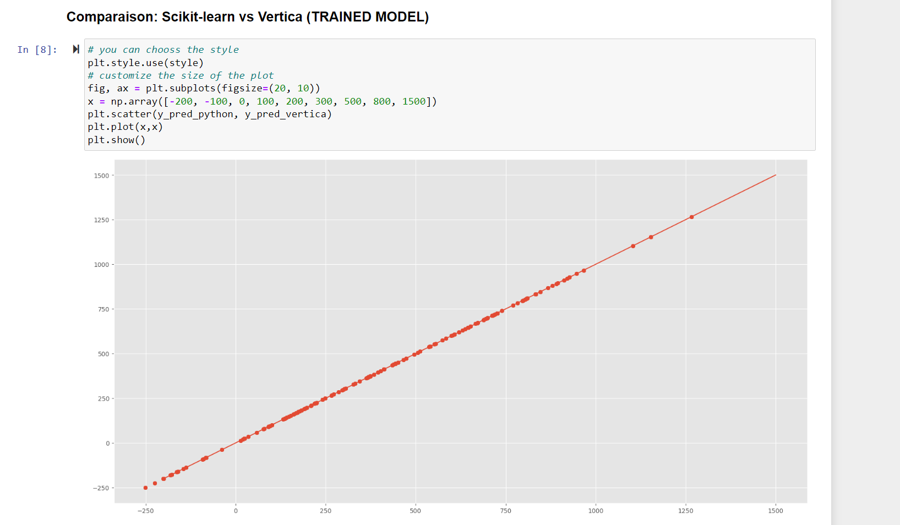

# UDx Model Training and Scoring

This repository provides an example of training a scikit-learn model using UDx (User-Defined Extensions) inside Vertica, a high-performance analytics database. Although we utilize a linear regression model for simplicity, the same steps and principles apply to any other model.

## Getting Started
Before proceeding, ensure that you have the necessary dependencies installed on the server side. It is recommended to create a virtual environment and install the required packages within it. Follow the steps below to create a Python virtual environment:

~~~~bash
/opt/vertica/sbin/python3 -m venv /path/to/new/environment
~~~~

Next, install the required dependencies using pip:

~~~~bash
source path/to/new/environment/bin/activate
pip3 install scikit-learn
~~~~

Now that your environment and dependencies are set up, upload the `model_training_scoring.py` file to the server. Proceed by executing the following SQL query in the Vertica SQL editor:

~~~~sql
CREATE OR REPLACE LIBRARY library_name AS '/path/to/model_training_scoring.py' DEPENDS '/path/to/new/environment/lib/python3.9/site-packages/*' LANGUAGE 'Python';
~~~~
## Training the Model
To train the model, create the transform function by executing the following SQL query:
~~~~sql
CREATE OR REPLACE TRANSFORM FUNCTION function_name_1 AS NAME 'LinearRegressionTrainFactory' LIBRARY library_name;
~~~~

Afterward, create the scalar function responsible for model prediction:
~~~~sql
CREATE OR REPLACE FUNCTION function_name_2 AS LANGUAGE 'Python'  NAME 'ModelScoringFactory' LIBRARY library_name;
~~~~

To initiate the model training process, execute the following SQL query:
~~~~sql
SELECT function_name_1(response_column_name, var1_column_name, var2_column_name, var3_column_name, var4_column_name, var5_column_name) OVER () FROM table_name;
~~~~
Upon completion, the trained model will be saved in a directory named __trained_models__.

### Using Model Parameters
If you wish to utilize model parameters during the training process, you can make use of the `USING PARAMETERS` statement as shown below:

~~~~sql
SELECT function_name_1(response_column_name, var1_column_name, var2_column_name, var3_column_name, var4_column_name, var5_column_name USING PARAMETERS param_name1='value1' , param_name2='value2',....) OVER () FROM table_name;
~~~~

For our example, we provide support for all the parameters used by the scikit-learn linear regression model, including:

        - fit_intercept
        - copy_X
        - n_jobs
        - positive

## Performing Inference
To perform inference within Vertica, a model name parameter is required. Execute the following SQL query to score new data using the trained model:

~~~~sql
SELECT function_name_2(var1_column_name, var2_column_name, var3_column_name, var4_column_name, var5_column_name USING PARAMETERS model_name='trained_model') FROM table_name;
~~~~

### Model Comparison
We conducted a comparison between a model trained inside Vertica using UDx and a model trained in a Python environment.

